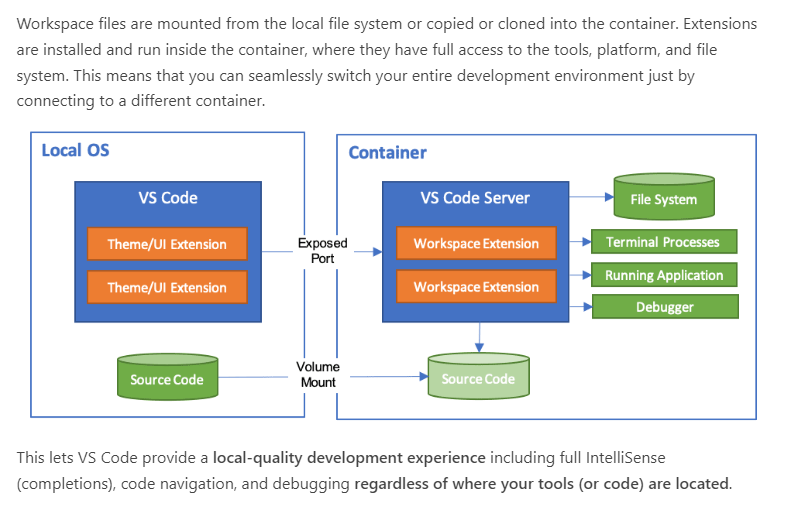

# Docker Development Guide

This guide covers the containerized development workflow for the MPADAO template project. It explains why you should use the container, what it provides, and walks through practical use cases.

## Why Use a Container?

- **Reproducible builds** — every developer gets the exact same compiler versions, libraries, and tools regardless of host OS.
- **No host setup required** — no need to install GCC 14, Clang 18, Boost, or CMake on your machine.
- **CI parity** — the container mirrors the CI environment, so builds that pass locally will pass in GitHub Actions.
- **Cross-compiler validation** — both GCC 14 and Clang 18 live in a single image, making it easy to catch portability bugs before pushing.

## What's in the Container

The image is based on **Ubuntu 24.04** and ships with:

| Tool       | Version  | Notes                                  |
|------------|----------|----------------------------------------|
| GCC        | 14       | Default compiler (`gcc`, `g++`, `cc`, `c++`) |
| Clang      | 18       | Available as `clang-18` / `clang++-18` |
| CMake      | 3.28+    | Ubuntu 24.04 package                   |
| Make       | —        | GNU Make                               |
| Boost      | system   | Headers only (`libboost-dev`)          |
| Git        | system   | For submodule operations               |

The container runs as a non-root `dev` user with `WORKDIR /home/dev`. GCC 14 is registered as the default compiler through `update-alternatives`.

## Getting Started

### Prerequisites

- [Docker](https://docs.docker.com/get-docker/) installed and running.

### Building the Image

From the repository root:

```bash
docker build -t stillwater/mpadao:latest docker/
```

Or use the convenience script:

```bash
./docker/build.sh
```

The script also supports pushing to Docker Hub:

```bash
./docker/build.sh --push
```

### Running Interactively

Mount the repository into the container so edits are shared between host and container:

```bash
docker run --rm -it -v $(pwd):/home/dev/mpadao stillwater/mpadao:latest
```

Inside the container, your project is at `/home/dev/mpadao`.

## VSCode DevContainer Workflow

The project includes a DevContainer configuration at `.devcontainer/devcontainer.json`.

### Opening the Project

1. Install the **Dev Containers** extension in VSCode.
2. Open the repository folder in VSCode.
3. Press `Ctrl+Shift+P` (or `Cmd+Shift+P` on macOS) and select **Dev Containers: Reopen in Container**.
4. VSCode will pull or build the `stillwater/mpadao:latest` image and start the container.

### What Happens Automatically

- **`postCreateCommand`** runs `git submodule init && git submodule update` to fetch Universal, MTL4, GoogleTest, and Abseil sources.
- **Extensions installed:** `ms-vscode.cpptools` (IntelliSense, debugging) and `ms-vscode.cmake-tools` (CMake integration).

Once the container starts, you can build and test immediately — no manual setup.



## Use Case 1: First-Time Project Setup

A complete walkthrough from clone to passing tests.

```bash
# Clone the repository
git clone https://github.com/stillwater-sc/mpadao-template.git
cd mpadao-template

# Build the development container
docker build -t stillwater/mpadao:latest docker/

# Start the container with the repo mounted
docker run --rm -it -v $(pwd):/home/dev/mpadao stillwater/mpadao:latest

# --- Inside the container ---

cd mpadao

# Initialize submodules (Universal, MTL4, GoogleTest, Abseil)
git submodule init && git submodule update

# Build the project
mkdir build && cd build
cmake ..
make -j$(nproc)

# Run the test suite
ctest
```

After `ctest` completes, all tests should pass. Binaries are placed in `build/` and can be installed to the project root with `make install`.

## Use Case 2: Cross-Compiler Validation

Catch portability issues by building with both compilers. Use separate build directories so artifacts don't conflict.

### Build with GCC (default)

```bash
mkdir build_gcc && cd build_gcc
cmake ..
make -j$(nproc)
ctest
cd ..
```

### Build with Clang

```bash
mkdir build_clang && cd build_clang
CC=clang-18 CXX=clang++-18 cmake ..
make -j$(nproc)
ctest
cd ..
```

### What to Look For

- **Different warnings** — GCC and Clang report different diagnostics. A clean build under both compilers gives higher confidence.
- **Subtle UB differences** — undefined behavior may manifest differently between compilers.
- **Standard library differences** — `libstdc++` (GCC) vs `libc++` (Clang) can expose assumptions about container behavior or header availability.

Both `build_gcc/` and `build_clang/` are already listed in `.gitignore`, so they won't pollute your repository.

## Use Case 3: Debugging a Failing Test

### Create a Debug Build

Omit `-O3` optimizations so the debugger can step through code accurately:

```bash
mkdir build_debug && cd build_debug
cmake -DCMAKE_BUILD_TYPE=Debug ..
make -j$(nproc)
```

### Run a Specific Test

The test binary is `test/mpadao_tests`. Run it directly for full output:

```bash
./test/mpadao_tests
```

Use GoogleTest filters to run a single test or group:

```bash
# Run tests matching a pattern
./test/mpadao_tests --gtest_filter=*Posit*

# List all available tests without running them
./test/mpadao_tests --gtest_list_tests
```

### Debug with GDB

GDB is available inside the container:

```bash
gdb ./test/mpadao_tests
```

Common GDB commands:

```
(gdb) break main
(gdb) run --gtest_filter=*Posit*
(gdb) backtrace
(gdb) print variable_name
(gdb) continue
```

## Build Configuration Reference

### CMake Options

| Option                  | Default | Description                                             |
|-------------------------|---------|---------------------------------------------------------|
| `BUILD_DEMONSTRATION`   | `ON`    | Build example applications in `src/apps/`               |
| `ENABLE_TESTS`          | `ON`    | Build the GoogleTest test suite                         |
| `MPADAO_ENABLE_ABSEIL`  | `OFF`   | Enable Abseil logging support (requires C++20)          |
| `CMAKE_BUILD_TYPE`      | —       | `Debug` (no optimizations) or `Release` (`-O3`)         |
| `CMAKE_INSTALL_PREFIX`  | project root | Where `make install` places binaries and headers   |

### Quick-Reference Commands

```bash
# Fastest possible build (skip demos and tests)
cmake -DBUILD_DEMONSTRATION=OFF -DENABLE_TESTS=OFF ..
make -j$(nproc)

# Full build with Abseil logging
cmake -DMPADAO_ENABLE_ABSEIL=ON ..
make -j$(nproc)

# Debug build
cmake -DCMAKE_BUILD_TYPE=Debug ..
make -j$(nproc)

# Install to project root (bin/, lib/, include/)
make install

# Run all tests
ctest

# Run tests with verbose output
ctest --verbose
```

## Tips

- **Keep the image up to date.** Rebuild periodically to pick up Ubuntu security patches and tool updates:
  ```bash
  docker build --no-cache -t stillwater/mpadao:latest docker/
  ```
- **Use parallel builds.** Always pass `-j$(nproc)` to `make` to use all available cores.
- **Organize build directories.** The `.gitignore` already covers `build/`, `build_gcc/`, `build_clang/`, and `build_msvc/`. Use these names to keep your workspace clean.
- **Persist your shell history.** Mount a volume for bash history if you want it to survive container restarts:
  ```bash
  docker run --rm -it \
    -v $(pwd):/home/dev/mpadao \
    -v mpadao-bash-history:/home/dev/.bash_history_vol \
    stillwater/mpadao:latest
  ```
- **Submodule updates after pulling.** If upstream adds or updates a submodule, re-run inside the container:
  ```bash
  git submodule update --init --recursive
  ```
